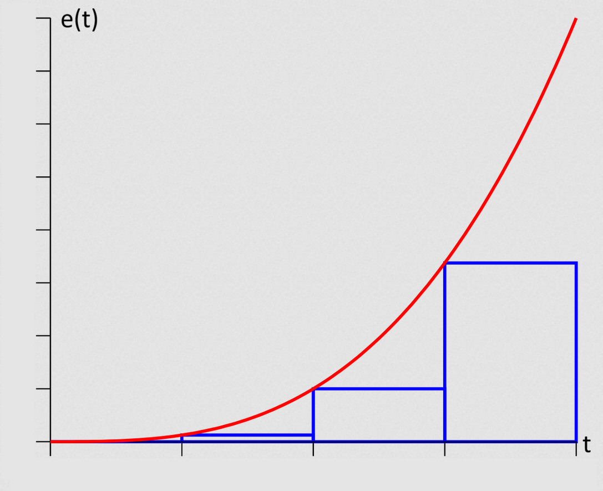
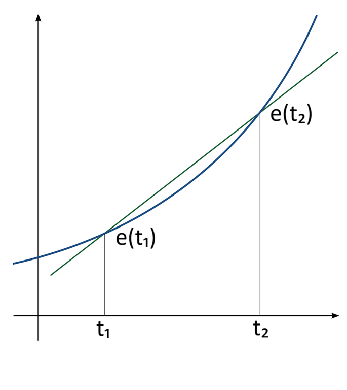

# Lab 4: Wall Following

This lab is the first lab that is entirely collaborative. Each team will
demonstrate and submit one implementation of the Wall Follow algorithm.

## Learning Goals

- Implement a PID controller to make the car follow the wall at a distance.
- Fine-tune PID values to ensure safety and optimize performance.

## Lab Setup

We will build off the local file structure given in the first lab. Keep this
structure in mind while you are working through the instructions!

```
${HOME}
  |
  +-- lab1_ws/              -- Lab 1 Workspace folder
  |
  +-- lab2_ws/              -- Lab 2 Workspace folder
  |
  +-- lab3_ws/              -- Lab 3 Workspace folder
  |
  +-- lab4_ws/              -- Lab 4 Workspace folder (NEW)
  |
  +-- sim_ws/               -- Simulator Workspace folder
```

To start with the lab, clone the repository:

```bash
cd ~
git clone https://github.com/unlv-f1/lab4 lab4_ws
```

Then, mount *~/lab4_ws* onto your Docker container, just as you've done for the
previous labs. The repository contains the base code for you to get started.

## Part 1: Applying PID to Wall Following

### 1-1: PID in the Time Domain

The goal of PID controller is to maintain certain parameter(s) of a system
around a specified set point.

PID controllers are used in a variety of applications requiring closed-loop
control. One example is an air-conditioning system trying to keep a room as
close as possible to 72 degrees. Another example is a drone trying to
maintain a constant of height of 5 meters off the ground. PID
controllers are one way of implementing these systems (although they
may aren't necessarily the best choice).

One example of a PID controller that's *already on the car* is the VESC speed
controller. If the motor is given an RPM set point, the VESC uses a PID
controller to send the correct amount of electricity to the motors to
meet the target RPM. (You won't need to tune this controller.)

The general equation for a PID controller in the time domain, as
discussed in lecture, is as follows: 

$$
u(t)=K_{p}e(t)+K_{i}\int_{0}^{t}e(t^{\prime})dt^{\prime}+K_{d}\frac{d}{dt}(e(t))
$$

Explanation of each variable:

* $u(t)$: Controller output
* $e(t)$: Error term (set point - process variable)
* $K_p, K_i, K_d$: Constants that determine how much **weight** each of the
  three components (proportional, integral, and derivative) get.

### 1-2: Wall Following

In the context of our car, the parameter we are trying to control is the
**distance to the wall**. So, the setpoint is the **desired distance to the**
**wall**.


Let's consider an instant in time $t$. Let $D_t$ be the distance to
the right wall $D_t$. Suppose the car is at an arbitrary orientation
with respect to the right wall; let the angle between the car's x-axis
and the axis in the direction along the wall is denoted by the angle
$\alpha$. 

We will obtain two distances (ranges from our laser scan data) to the wall:

1. One **90 degrees** to the right of the car's x-axis. (This is beam $b$.)
2. One at an angle $\theta$ ($0<\theta\leq70$ degrees) from the first beam.
   (This is beam $a$.)


*Figure 1: Distance and orientation of the car relative to the wall* 

Using the two distances $a$ and $b$ from the laser scan, the angle $\theta$
between the laser scans, and some trigonometry, we can express $\alpha$ as 

$$
\alpha=\tan^{-1}\left(\frac{a\cos(\theta)-b}{a\sin(\theta)}\right)
$$

From here, we can express $D_t$, the current distance between the car and the
right wall, as: 

$$
D_t=b\cos(\alpha)
$$

What's our error term $e(t)$, then? It's simply the difference between the
desired distance and actual distance!

$$
e(t) = D_{setpoint} - D_t
$$

For example, if our desired distance is 1 meter from the wall, then $e(t)$
becomes $1-D_t$. 
	
However, we have a problem on our hands. Remember that this is a race: your car
will be traveling at a high speed and therefore will have a non-instantaneous
response to whatever speed and servo control you give to it. If we simply use
the current distance to the wall, we might end up turning too late, and the car
may crash!

Therefore, we must look to the future and *project the car ahead by a certain*
*lookahead distance* $L$. Our new distance $D_{t+1}$ will then be:

$$D_{t+1}=D_t+L\sin(\alpha)$$


*Figure 2: Finding the future distance from the car to the wall*

We're almost there. Our control algorithm gives us a **steering angle** for the
VESC, but we would also like to slow the car down around corners for safety.
We can compute the speed in a step-like fashion based on the steering angle,
or equivalently the calculated error, so that as the angle exceeds
progressively larger amounts, the speed is cut in discrete increments. For
this lab, a good starting point for the speed control algorithm is: 

- If the steering angle is between 0 degrees and 10 degrees, the car
  should drive at 1.5 meters per second. 
- If the steering angle is between 10 degrees and 20 degrees, the
  speed should be 1.0 meters per second. 
- Otherwise, the speed should be 0.5 meters per second.

## 1-3: Algorithm Summary

So, in summary, here's what we need to do:

1. Obtain two laser scans (distances) $a$ and $b$.
2. Use the distances $a$ and $b$ to calculate the angle $\alpha$ between the
   car's $x$-axis and the right wall. 
3. Use $\alpha$ to find the current distance $D_t$ to the car and then $\alpha$
   and $D_t$ to find the estimated future distance $D_{t+1}$ to the wall. 
4. Run $D_{t+1}$ through the PID algorithm described above to get a steering
   angle.
5. Use the steering angle you computed in the previous step to compute
   a safe driving speed. 
6. Publish the steering angle and driving speed.

## Part 2: Implementation

### 2-1: Specification

Your team will be making a package named `wall_follow`, which implements the
Wall Following algorithm.

Your algorithm must **follow the left wall**, not the right wall as shown in
the figures in the previous section. Thus, you'll need to slightly modify some
of the equations.

#### Launching

Your package must contain a launch file which accepts:

* Maximum speed
* Distance setpoint (desired distance to the wall)
* Coefficients for the proportional, integral, and derivative terms

Below is an example launch command:

```
ros2 launch wall_follow wall_follow_launch.py speed_max:=2.0 \
    distance_setpoint:=1.0 kp:=1.0 ki:=0.01 kd:=0.1
```

You may declare any additional arguments, if needed. (For example, you can have
a parameter for lookahead.)

#### Simulator Demonstration

With the gym running, demonstrate that your car can drive **one lap** around
the Levine Hall map using wall follow. You must meet the following criteria:

- The vehicle autonomously drives a lap, following the left wall,
  around the track without collision. 
- The vehicle drives with imperceptible oscillations after turning the first
  corner. (Minimal wiggling!)
- The vehicle can successfully make it past the trap in the bottom of the
  simulator map. (The Trap is detailed in the later section.)

#### Vehicle Demonstration

After a successful simulator demonstration, you may copy your code to the car.

In your demonstration, run the stack (not the AEB stack launch!):

```bash
ros2 launch f1tenth_unlv_veh stack_launch.py
```

Then, launch your node:

```bash
ros2 launch wall_follow wall_follow_launch.py <YOUR_PARAMETERS...>
```

For your vehicle demonstration, there will be a segment of walls set up for you
to follow. Your car must meet the following criteria:

- The vehicle autonomously drives from the start to the end, following the
  left wall, without collision. 
- The vehicle can drive with imperceptible oscillations after turning
  the first corner. 
- The vehicle can successfully make it past any traps along the segment.

#### Code Submission

Each team will submit a link to their team's repository on Canvas.

### 2-2: Discretely Approximating the Integral and Derivative Terms

In Section 1-1, we reviewed the PID equation. But, here's an issue: we work in discrete time steps, so how do we calculate the integral and derivative?

One way to approximate the integral is using Left Riemann sums, which
graphically look like this:



Applying this to our context, we can take a running sum of each error value
calculated:

$$
\int_{0}^{t}e(t^{\prime})dt^{\prime} \approx \sum _{t^\prime = 0}^t e(t^{\prime})
$$

(The width of each rectangle is $1$, since we are working in units of time
steps)

For the derivative, we can take the finite difference approximation (using two
points), which graphically looks like:



The formula for the slope is:

$$
\frac{d}{dt}(e(t)) \approx \frac{e(t_2) - e(t_1)}{t_2 - t_1}
$$

In our context, we calculate this using the error value derived from one laser
scan message and comparing it against the previous message, resulting in:

$$
\frac{d}{dt}(e(t)) \approx e(t) - e(t-1)
$$

(Again, since we are working in time steps, $t_2-t_1$ is simply $1$.)

### 2-3: The Trap

On the South facing side of the simulator map lays a rectangular irregularity,
illustrated below. This portion of the map is a trap. It is used to test
implementations and catch the vehicle within its confines. Due to the tight
corners, it can be nearly impossible for the vehicle to maneuver out once it
has entered.


### 2-4: Clamping

The calculated control output $u(t)$, which is published as the
`steering_angle` may quickly get out of hand due to "integral windup".

You may use **clamping** to ensure that `steering_angle` is within an
acceptable range before publishing it to `/drive`. The maximum steering angle
in both directions should be 20 degrees.

A negative `steering_angle` will turn your vehicle right, and a positive
`steering_angle` to the left.

### 2-5: Performance Considerations

Logging to the terminal delays node processing and could affect the performance
of the car. In tight loops (e.g. looping through each laser scan angle), this
might drastically affect the performance.

Consider what information you would like to log in your code but also consider
its potential performance impact. You may also consider using a parameter to
control whether or not debug messages are printed.

## Grading Rubric

- Simulator Demonstration: **50** Points
- Vehicle Demonstration: **50** Points
